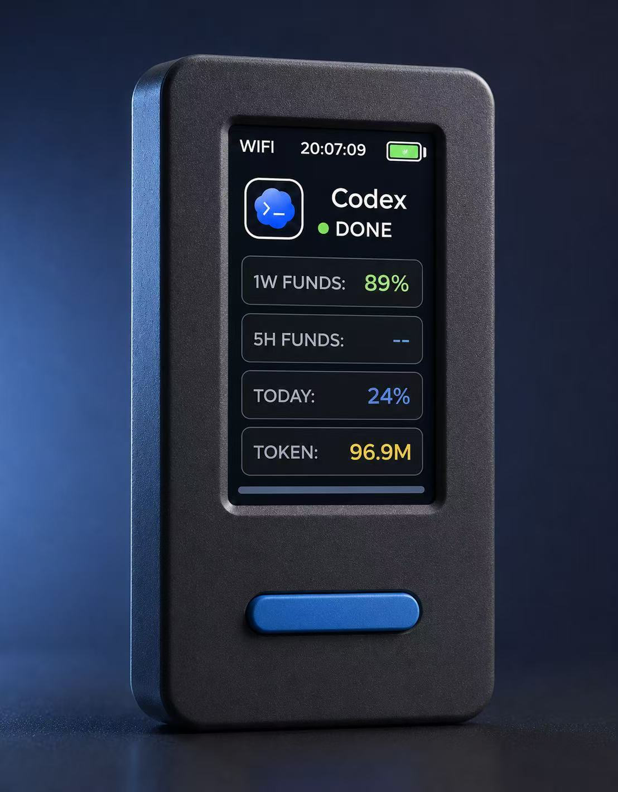
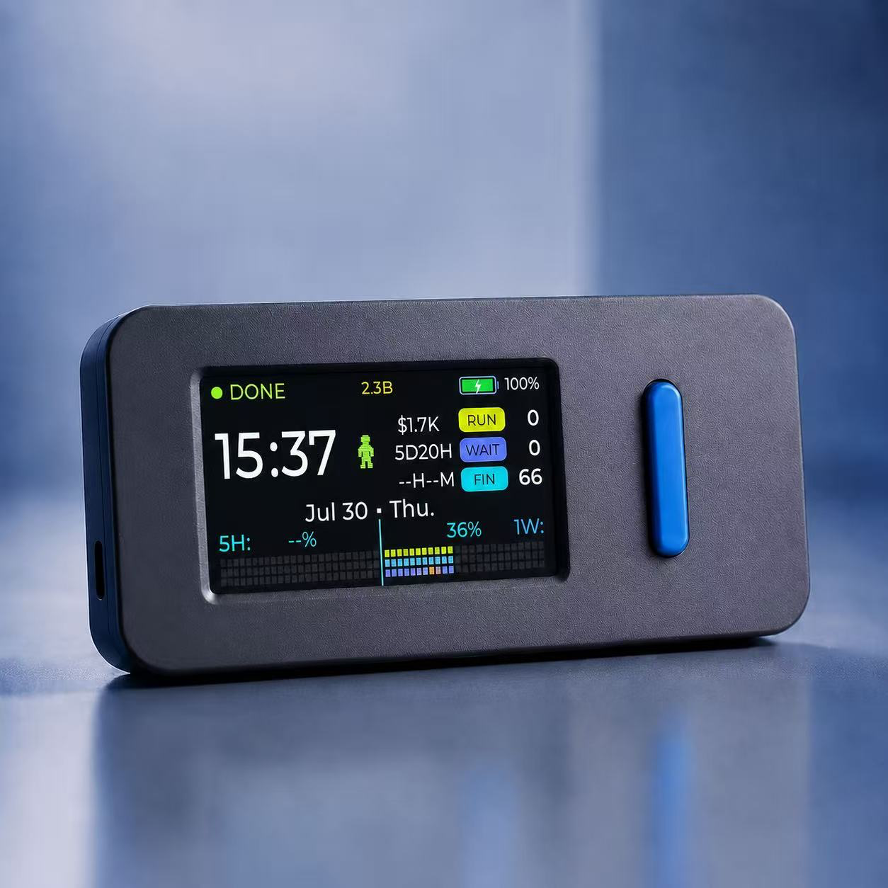

<div align="center">
  
  <h1>VibeStick-Codex</h1>
  <p><strong>A pocket-sized hardware companion for Codex.</strong></p>
  <p>
    Live status, quota awareness, task feedback, and push-to-talk input<br>
    on an M5Stack StickS3.
  </p>
  <p>
    <a href="#overview">Overview</a> ·
    <a href="#current-release">v0.3.1</a> ·
    <a href="#install">Install</a> ·
    <a href="#configuration">Configuration</a> ·
    <a href="#troubleshooting">Troubleshooting</a> ·
    <a href="#privacy">Privacy</a> ·
    <a href="README.zh-CN.md">简体中文</a>
  </p>
  <p>
    
    
    
    
    
    
  </p>
  <br>
  
</div>

## Current release

Version `0.3.1` was released on August 12, 2026 and makes the protected Wi-Fi
setup page open automatically after a phone joins the device access point. A
device without a saved network enters setup automatically; holding both buttons
for three seconds on the normal Codex screen restarts directly into setup.
Failed changes restore the previous network, and `http://192.168.4.1` remains
available when a phone suppresses its captive-portal window. The Bridge also
recognizes current nested Codex approval calls so WAIT notifications continue
to reach the StickS3.
The existing Bridge now includes a loopback-only voice-service settings page.
The Bridge is now packaged as a self-contained macOS DMG and a single Windows
Setup EXE, so ordinary users do not install Python or use a terminal. Windows
Codex controls, automatic paste, and HUD remain preview support pending real
Windows acceptance. Authenticated LAN discovery from `0.2.1` remains in place.
Download the firmware and desktop installers from the
[v0.3.1 Release](https://github.com/oliverxing2025/VibeStick-Codex/releases/tag/v0.3.1).

## What's new in v0.3.1

Released on August 12, 2026. Download the firmware, macOS Bridge DMG, Windows
Bridge Setup EXE, checksums, and complete notes from the
[v0.3.1 Release](https://github.com/oliverxing2025/VibeStick-Codex/releases/tag/v0.3.1).

Compared with v0.2.0:

- **Permanent Wi-Fi setup:** first boot opens a password-protected setup hotspot;
  its setup page opens automatically after a phone joins, users can choose a
  nearby 2.4 GHz network, and a failed change restores the previous network.
  Hold both buttons for three seconds to reopen setup later.
- **Secure Bridge pairing:** the device setup page accepts the locally generated
  pairing token, while authenticated discovery follows computer address changes.
- **Built-in voice settings:** the Bridge provides a loopback-only page for ASR
  provider, model, language, and API key configuration without echoing saved keys.
- **Packaged macOS Bridge:** the Apple Silicon DMG contains the Bridge, HUD,
  per-user startup services, pairing page, uninstaller, and SHA-256 checksum.
- **Windows preview package:** one per-user Setup EXE installs the Bridge, HUD,
  autostart, Codex controls, and automatic paste without requiring Python.
- **Cross-platform hardening:** computer paths, desktop controls, paste handling,
  packaging tests, and CI now cover macOS and Windows behavior.
- **Current WAIT detection:** nested Codex tool calls that require human
  approval are recognized by the Bridge and reported to the StickS3.

### Upgrade paths

| Download | Flash offset | Use it when | What it preserves |
| --- | ---: | --- | --- |
| `VibeStick-Codex-v0.3.1-app.bin` | `0x320000` | Updating the Codex slot on an already verified Codex + Hourglass dual-app device | Keeps the Hourglass slot, partition table, OTA metadata, and NVS untouched |
| `VibeStick-Codex-v0.3.1-full-install.bin` | `0x0` | Clean standalone installation, or intentionally replacing the existing firmware layout | Replaces the bootloader, partition table, OTA metadata, and application at `0x20000` |
| `VibeStick-Bridge-macOS-Apple-Silicon-v0.3.1.dmg` | — | Installing the self-contained Bridge on Apple Silicon macOS | Creates private configuration locally and preserves it during ordinary uninstall |
| `VibeStick-Bridge-Windows-v0.3.1-Setup.exe` | — | Installing the self-contained Bridge on 64-bit Windows | Installs per user and creates private configuration locally |

> [!WARNING]
> Verify the physical device identity, partition layout, image, and offset
> before writing. On a dual-app device, update Codex only with the application
> image at `0x320000`; writing the full image replaces the multi-firmware
> layout. Public release binaries contain no Wi-Fi, Bridge token, API key,
> device identifier, or computer address. A fresh device opens protected setup
> so these private values can be supplied locally without rebuilding firmware.

## Overview

VibeStick-Codex turns the StickS3 into a focused physical window into Codex. It keeps the information you check most often off the desktop and puts common controls under two hardware buttons.

| | Capability | What it does |
| --- | --- | --- |
| **01** | Live status | Shows Wi-Fi, time, battery, Codex state, animated status characters, and audible alerts. |
| **02** | Quota at a glance | Tracks remaining quota, usage consumed, today's tokens, and reset timing. |
| **03** | Push-to-talk | Records on button hold, transcribes on release, and places the text into Codex for review. |
| **04** | Adaptive dashboard | Rotates automatically between a detailed portrait view and a compact landscape task view. |

## Device experience

<table>
  <tr>
    <td width="42%" align="center">
      
    </td>
    <td width="58%" align="center">
      
    </td>
  </tr>
  <tr>
    <td valign="top">
      <strong>Push-to-talk input</strong><br>
      Hold the front blue button to record. Release it to transcribe and place the result into Codex for review.
    </td>
    <td valign="top">
      <strong>Adaptive landscape dashboard</strong><br>
      Rotate the device to see live status, battery, monthly usage, reset countdowns, task counts, and both quota windows.
    </td>
  </tr>
</table>

### What the screens show

| Screen | Display | Meaning |
| --- | --- | --- |
| **Landscape** | `RUNNING` / `WAITING` / `DONE` / `ERROR` / `OFFLINE` | Current Codex or bridge state. |
| **Landscape** | Animated pixel character | Runs while Codex is working, waits when human approval is required, and celebrates when a task completes. |
| **Landscape** | Battery icon + percentage | StickS3's locally measured battery level. |
| **Landscape** | Top-center token value, such as `50.7M` | Input plus output tokens observed since the start of the current calendar month. Cached context is included within input tokens, so this processed-token total can grow much faster than newly submitted text or billable uncached input. `K`, `M`, and `B` mean thousand, million, and billion. |
| **Landscape** | Dollar value, such as `$1.6K` | Estimated API-equivalent USD value of the observed monthly input, cached-input, and output tokens. It is an estimate based on the configured model-price table and [OpenAI API pricing](https://openai.com/api/pricing/), not an OpenAI bill or subscription charge. |
| **Landscape** | `6D00H` / `0H51M` | Time remaining until the weekly and five-hour quota windows reset. |
| **Landscape** | `RUN` / `WAIT` / `FIN` | Running tasks, tasks awaiting action, and tasks completed during the current local day. |
| **Landscape** | `5H` / `1W` percentages and particle rows | Remaining five-hour and weekly Codex quota. The blue divider separates the two independent windows. |
| **Portrait** | `1W FUNDS` / `5H FUNDS` | Remaining weekly and five-hour Codex quota percentages. |
| **Portrait** | `TODAY` | Current local day's consumption percentage inferred from the weekly quota samples observed by the bridge. |
| **Portrait** | `TOKEN` | Tokens accumulated in the current rolling seven-day quota cycle, not the calendar week or month. It restarts when that quota cycle resets. |

Both orientations also show connection/status information and local time. Values that the bridge cannot currently determine are shown as unavailable rather than guessed.

When a Codex task is waiting for a permission or approval response, `WAITING` takes priority over ordinary recent activity. The animated character and task counters therefore reflect the action the user needs to take, rather than continuing to show the task as merely running.

The monthly Token value is a local activity counter, not an OpenAI subscription quota or invoice. Repeated cached context is counted as processed input, while the adjacent dollar value applies the configured cached-input price separately when estimating an API-equivalent cost.

> [!NOTE]
> These are product renders. Minor details may differ from the current on-device firmware.

## Platform support

| Platform | Current support |
| --- | --- |
| **macOS** | The Apple Silicon DMG contains a self-contained Bridge and HUD, installs login LaunchAgents, generates the pairing token locally, and opens browser configuration. The current build is ad-hoc signed, not Developer ID signed or notarized. |
| **Windows** | The single Setup EXE contains the Bridge and HUD, installs per-user autostart, generates the pairing token locally, and opens browser configuration. CI builds and tests it, but real Windows device/app acceptance is still required before stable support. |

The primary verified flow below remains macOS. Windows preview installation is
documented separately and must not be treated as real-device verified.

## Before you start

- [ ] M5Stack StickS3 and a USB-C data cable.
- [ ] A supported Mac or Windows PC on the same private network as the StickS3.
- [ ] Wi-Fi name and password. The Wi-Fi must be 2.4 GHz; StickS3 / ESP32-S3 does not support 5 GHz Wi-Fi.
- [ ] An ASR API key for speech transcription. The default example uses the OpenAI-compatible [SiliconFlow](https://cloud.siliconflow.cn/) API, or you can use another compatible provider's `base_url` and model name.

Building the firmware needs ESP-IDF v5.5.x — a one-time toolchain install (~1 GB, a few minutes). The install steps below set it up for you; no need to pre-install. Reference: Espressif's [ESP-IDF v5.5.1 ESP32-S3 guide](https://docs.espressif.com/projects/esp-idf/en/v5.5.1/esp32s3/get-started/index.html).

<p align="center"><strong>Install Bridge → Flash firmware → Pair device → Configure voice → Verify</strong></p>

## Install

### Install the packaged Bridge

M5Burner distributes the StickS3 firmware only. The Bridge is required for
Codex status, authenticated pairing, speech transcription, HUD, and automatic
paste, and is downloaded once from this repository's
[Releases page](https://github.com/oliverxing2025/VibeStick-Codex/releases).
Both installers generate a fresh pairing token on the user's computer; no
Wi-Fi password, API key, or fixed token is embedded in either package.

#### macOS

1. Download `VibeStick-Bridge-macOS-Apple-Silicon-v0.3.1.dmg` and its SHA-256 file.
2. Verify the checksum, open the DMG, and drag `VibeStick Bridge.app` to Applications.
3. Because this community build is not Developer ID signed or notarized,
   Control-click the app, choose **Open**, then confirm **Open** on first launch.
4. The app installs per-user login services and opens
   `http://127.0.0.1:8765/setup/voice`. Configure ASR and copy the Bridge pairing code.
5. Grant Accessibility access to **VibeStick Bridge** when macOS requests it;
   this is required only for the explicit Codex shortcuts and paste actions.

To uninstall, reopen the DMG and run `Uninstall VibeStick Bridge.command`.
It removes the app and login services but deliberately preserves the private
configuration directory until the user deletes it manually.

> [!WARNING]
> Download installers only from this repository's official Release, verify the
> published SHA-256 checksum, and never use a package that already contains an
> API key or pairing code. The current macOS package has not completed repeated
> testing across multiple Mac models and macOS versions; please report issues.

#### Windows preview

1. Download `VibeStick-Bridge-Windows-v0.3.1-Setup.exe` and its SHA-256 file.
2. Verify the checksum and run the installer. It installs only for the current
   user, adds Bridge/HUD autostart, and opens the same local pairing page.
3. If Windows Firewall prompts, allow VibeStick only on private networks.

> [!WARNING]
> The Windows installer is not code-signed and Windows may show SmartScreen.
> Use **More info → Run anyway** only after confirming the official download
> source and checksum. Windows remains preview-only until it is accepted on a
> real Windows Codex installation with a physical StickS3.

### Flash and pair the StickS3

The following source-build route is for developers. Ordinary M5Burner users can
burn the published firmware and continue at step 7.

> Legend: steps marked 👤 are PHYSICAL steps that need a human to act directly, such as plugging in the cable, long-pressing or short-pressing the power button, and granting macOS permissions in System Settings. AI agents should run the shell steps in order, then pause at each 👤 step and ask the user to complete it before continuing.

1. Enter the local project and create config files:

```sh
cd VibeStick-Codex
./scripts/setup.sh
```

2. Fill the local config values the human prepared:

```sh
open -e firmware/sticks3/include/vibe_stick_secrets.h
open -e .env
```

Keep the Bridge token and fallback computer host in `vibe_stick_secrets.h`.
Compiled Wi-Fi values are now only an optional first-run migration fallback;
normal Wi-Fi setup and later network changes happen on the device.

Developers who intentionally run from source can install the macOS Bridge and
HUD before pairing the device:

```sh
./scripts/install.sh
```

The source installer opens `http://127.0.0.1:8765/setup/voice`. Configure the speech
provider there and keep the page open so its device pairing token can be copied
into the StickS3 setup page. This is part of the Bridge, not another app.

3. 👤 Plug the StickS3 into the Mac with the USB-C data cable.

4. 👤 Put the StickS3 into download mode: long-press the side power button until the blue LED double-blinks and the screen turns off. This is required for ESP32-S3 flashing.

5. Install ESP-IDF if it is not already present, then load it into the current shell. This is a one-time toolchain install with a large ~1 GB download and can take a few minutes. Run the load command in every new terminal before `idf.py`:

```sh
if [ ! -d "$HOME/esp/esp-idf" ]; then
  mkdir -p ~/esp && cd ~/esp
  git clone -b v5.5.1 --recursive https://github.com/espressif/esp-idf.git
  cd esp-idf && ./install.sh esp32s3
fi
. "$HOME/esp/esp-idf/export.sh"
```

Or install via Espressif's [official guide](https://docs.espressif.com/projects/esp-idf/en/v5.5.1/esp32s3/get-started/index.html). If `install.sh` fails, ensure `git`, `python3`, and `cmake` are present, or follow the official guide. Adjust the path if ESP-IDF is installed elsewhere.

6. Build and flash the firmware:

```sh
cd firmware/sticks3
idf.py -p <port> build flash
cd ../..
```

If you do not know the port, run:

```sh
ls /dev/cu.*
```

Wait for `Hash of data verified`.

7. 👤 Short-press the power button to wake the screen. With no saved network,
the device shows a temporary Wi-Fi SSID, eight-digit password, and `192.168.4.1`.
Connect a phone to that protected network; its captive-portal window should
open automatically. If the phone suppresses the window, open
`http://192.168.4.1` manually. Choose the same 2.4 GHz Wi-Fi as the computer
from the nearby-network list, or enter a hidden network manually. On first
pairing, copy the Bridge pairing token from the
computer's voice settings page into the device page. To change only Wi-Fi later,
the token can remain blank. On the normal Codex screen, hold both device buttons
for three seconds to restart into setup; a failed change restores the previous network.

8. Return to the already-open local voice settings page if ASR still needs to
be configured. The saved API key is never echoed back to the page.

9. 👤 Packaged macOS users grant Accessibility to **VibeStick Bridge**.
Source-install users grant it to the Python runner or terminal that runs VibeStick.

10. Check the setup:

```sh
./scripts/doctor.sh
```

Aim for all required checks to pass. The StickS3 should show Wi-Fi, time, battery, Codex status, and `1W FUNDS / 5H FUNDS / TODAY / TOKEN`.

11. 👤 Test both buttons:

- Front blue, short press: open/focus Codex; approve when Codex is waiting for confirmation.
- Front blue, double press: refresh `1W FUNDS / 5H FUNDS / TODAY / TOKEN`.
- Front blue, hold and release: record, transcribe, and enter into Codex without submitting.
- Side, short press: approve all waiting Codex tasks across projects; if none are waiting, send the current input.
- Side, double press: clear the current input text.
- Side, fast triple click: switch to the Hourglass app in `ota_0` and restart, when a compatible dual-firmware layout is installed.
- Side, hold: create a new Codex chat.

For development without installing LaunchAgents, run `./scripts/dev.sh` from the repository root instead of `./scripts/install.sh`.

See [Dual-firmware installation and switching](docs/MULTI_FIRMWARE.md) before installing or updating the Hourglass companion app.

## Troubleshooting

### `command not found: idf.py`

ESP-IDF is installed but not loaded into the current shell, or it has not been installed yet. Source ESP-IDF's `export.sh`, then run `idf.py` again:

```sh
. $HOME/esp/esp-idf/export.sh
```

Adjust the path if your ESP-IDF checkout is somewhere else. Run this once in every new terminal before using `idf.py`.

### Flashing says "Device not configured" or cannot open the serial port

Unplug and replug the USB-C data cable. Put the StickS3 into download mode again: long-press the side power button until the blue LED double-blinks and the screen turns off. Run `ls /dev/cu.*` to find the port, then retry `idf.py -p <port> build flash`.

### StickS3 cannot join Wi-Fi

Use a 2.4 GHz Wi-Fi network. StickS3 / ESP32-S3 does not support 5 GHz Wi-Fi.
On the normal Codex screen, hold both buttons for three seconds, join the protected setup
SSID shown on screen, then open `http://192.168.4.1`. The computer and StickS3
must join the same private LAN; changing the computer's Wi-Fi does not remotely
change the device's saved Wi-Fi.

### Recording transcribes but does not paste

On macOS, open System Settings -> Privacy & Security -> Accessibility and enable
**VibeStick Bridge**. Source-install users enable the Python runner or terminal
that runs VibeStick. On Windows, confirm that the Bridge is running and that the
target text box is focused.

### "No transcription adapter configured"

Open `http://127.0.0.1:8765/setup/voice` on the Bridge computer and save the
provider, model, and API key. Developers may still configure the equivalent
`.env` values manually.

### Cannot find `.env`

`.env` is a hidden file. Open it with:

```sh
open -e .env
```

### Transcription fails or times out with SSL/network errors

The ASR provider is usually unreachable from your current network. Configure a reachable OpenAI-compatible ASR provider or your network proxy.

## Configuration

Do not commit real API keys, local tokens, Wi-Fi credentials, local logs, or generated recording files.

Empty values in `.env` generally mean "use the built-in default". `scripts/dev.sh` loads `.env` from the repository root. On macOS, `scripts/install.sh` copies it to `~/Library/Application Support/VibeStick/.env`; the Windows preview uses `%LOCALAPPDATA%\VibeStick\.env`.

### Core settings

- `VIBE_STICK_PROJECT_ROOT`: project root used for local Codex session observation.
- `VIBE_STICK_PROJECT_NAME`: optional display-name override.
- `VIBE_STICK_BRIDGE_TOKEN`: shared token required whenever the bridge binds outside loopback, such as `0.0.0.0`.
- `VIBE_STICK_MAX_RECORDING_AUDIO_BYTES`: max `/recording/audio` body size, default `2000000`.
- `VIBE_STICK_RECORDING_USE_MAC_MIC`: set to `0` to disable Mac microphone fallback.
- `VIBE_STICK_RETAIN_RECORDINGS`: recordings are deleted after processing by default; set to `1` only for intentional debugging.
- `VIBE_STICK_AUTO_ENTER`: set to `1` to press Return after pasting.

### ASR option 1: SiliconFlow (recommended default)

```sh
VIBE_STICK_ASR_PROVIDER=openai-compatible
VIBE_STICK_ASR_BASE_URL=https://api.siliconflow.cn/v1
VIBE_STICK_ASR_API_KEY=your-siliconflow-key
VIBE_STICK_ASR_MODEL=FunAudioLLM/SenseVoiceSmall
VIBE_STICK_ASR_LANGUAGE=zh
VIBE_STICK_ASR_TIMEOUT_SECONDS=15
VIBE_STICK_ASR_ATTEMPTS=2
```

Audio sent to a cloud ASR provider leaves the Mac.

### ASR option 2: any OpenAI-compatible provider

Use any provider that accepts `POST {base_url}/audio/transcriptions`.

```sh
VIBE_STICK_ASR_PROVIDER=openai-compatible
VIBE_STICK_ASR_BASE_URL=https://example.com/v1
VIBE_STICK_ASR_API_KEY=your-api-key
VIBE_STICK_ASR_MODEL=provider-model-name
```

Groq is also supported as an overseas preset:

```sh
VIBE_STICK_ASR_PROVIDER=groq
VIBE_STICK_ASR_API_KEY=your-groq-key
```

The legacy aliases `VIBE_STICK_GROQ_API_KEY`, `VIBE_STICK_GROQ_MODEL`, and `VIBE_STICK_GROQ_LANGUAGE` remain supported.

### ASR option 3: local command (offline)

```sh
VIBE_STICK_TRANSCRIBE_CMD=/path/to/transcribe-command
VIBE_STICK_TRANSCRIBE_TIMEOUT_SECONDS=120
```

The command receives the recording session JSON on stdin and should print the final transcript to stdout.

## Privacy

- The bridge has no analytics or telemetry.
- State reads and control endpoints require the shared bridge token when the bridge is available on the LAN.
- Local runtime files are restricted to the current computer user.
- Complete transcripts are not persisted, and recordings are deleted after processing by default.
- StickS3-to-computer traffic uses local HTTP and is not encrypted. Use only trusted private Wi-Fi and never expose port `8765` to the internet.
- Cloud ASR sends recording audio to the configured provider.

Read the complete [privacy and data-flow guide](docs/PRIVACY.md).

## Project layout

```text
VibeStick-Codex/
  README.md
  README.zh-CN.md
  .env.example
  docs/
  firmware/sticks3/
  bridge/src/vibe_stick/
  app/macos/VibeStickHUD/
  app/windows/VibeStickHUD.py
  packaging/macos/
  packaging/windows/
  scripts/
  tests/
```

## Checks

```sh
python3 -m compileall -q bridge/src tests app/windows
PYTHONPATH=bridge/src python3 -m unittest discover -s tests
bash -n scripts/setup.sh scripts/doctor.sh scripts/install.sh scripts/build-macos.sh packaging/macos/VibeStickBridge.sh
```

Firmware builds still require ESP-IDF:

```sh
cd firmware/sticks3
. $HOME/esp/esp-idf/export.sh
idf.py build
```

## Current limits

- The macOS DMG is ad-hoc signed and is not Developer ID signed or notarized.
- The packaged app has not completed repeated testing across multiple Mac models and macOS versions.
- Windows support remains preview-only until accepted on a real Windows Codex installation and StickS3.
- The firmware targets M5Stack StickS3 only.
- The monthly token and USD figures are derived from locally observed Codex session records. They may be incomplete if records are unavailable, and the USD figure is an API-equivalent estimate rather than actual account billing.
- ASR reliability depends on microphone capture, uploaded PCM quality, provider availability, and configured model.

## Contributing & security

Contributions welcome — see [CONTRIBUTING.md](CONTRIBUTING.md). To report a vulnerability,
see [SECURITY.md](SECURITY.md) (please report privately).

## Copyright, assets & licenses

The original VibeStick software is Copyright (c) 2026 Gary Zhang.
VibeStick-Codex modifications are Copyright (c) 2026 Oliver Xing. The original
software and these modifications are distributed under the repository's
[MIT License](LICENSE), with both copyright notices retained.

Unless a file states otherwise, the Codex-specific bridge, macOS HUD, StickS3
firmware additions, simple provider/status icons, screenshots, device previews,
and pixel status animations created for this repository are covered by the same
MIT License. This does not relicense third-party materials or grant rights in
third-party names and trademarks.

The landscape dashboard's visual design and information architecture were
inspired by [CharlexH/CodeBuddy](https://github.com/CharlexH/CodeBuddy) and
independently reimplemented with ESP-IDF and LVGL. No CodeBuddy source code or
artwork is redistributed here.

Third-party components retain their own licenses. In particular, the generated
Noto Sans SC glyph subset remains under the bundled
[SIL Open Font License 1.1](firmware/sticks3/third_party/noto-sans-sc/OFL.txt),
and the BMI270 driver retains its included upstream license. ESP-IDF, LVGL, and
managed components are governed by their respective license terms. See
[NOTICE](NOTICE) and the [third-party audit](docs/THIRD_PARTY_AUDIT.md) for the
complete attribution and distribution notes.

M5Stack, StickS3, OpenAI, and Codex names and marks belong to their respective
owners and are used only to describe compatibility and integration. This is an
independent community project and is not affiliated with, endorsed by, or an
official product of M5Stack or OpenAI.
