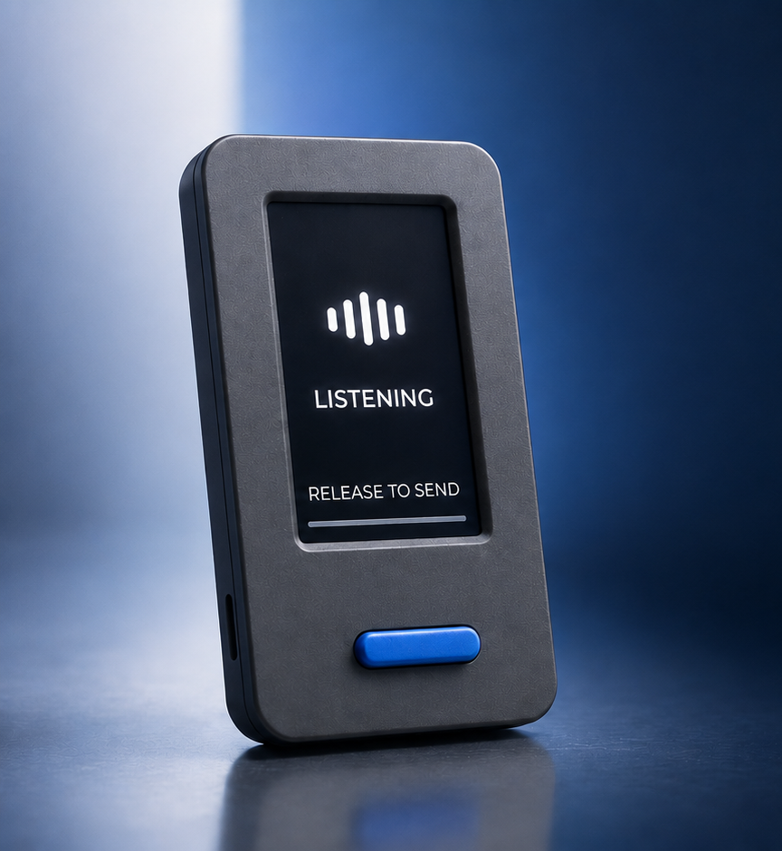
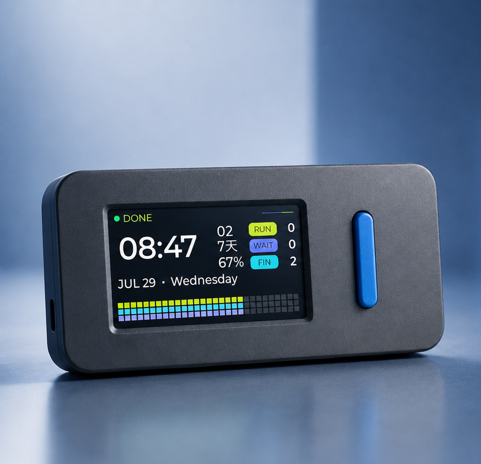

<div align="center">
  
  <h1>VibeStick-Codex</h1>
  <p><strong>A pocket-sized hardware companion for Codex.</strong></p>
  <p>
    Live status, quota awareness, task feedback, and push-to-talk input<br>
    on an M5Stack StickS3.
  </p>
  <p>
    <a href="#overview">Overview</a> ·
    <a href="#install">Install</a> ·
    <a href="#configuration">Configuration</a> ·
    <a href="#troubleshooting">Troubleshooting</a> ·
    <a href="#privacy">Privacy</a> ·
    <a href="README.zh-CN.md">简体中文</a>
  </p>
  <p>
    
    
    
    
    
  </p>
  <br>
  
</div>

## Overview

VibeStick-Codex turns the StickS3 into a focused physical window into Codex. It keeps the information you check most often off the desktop and puts common controls under two hardware buttons.

| | Capability | What it does |
| --- | --- | --- |
| **01** | Live status | Shows Wi-Fi, time, battery, Codex state, and audible alerts. |
| **02** | Quota at a glance | Tracks remaining quota, usage consumed, today's tokens, and reset timing. |
| **03** | Push-to-talk | Records on button hold, transcribes on release, and places the text into Codex for review. |
| **04** | Adaptive dashboard | Rotates automatically between a detailed portrait view and a compact landscape task view. |

## Device experience

<table>
  <tr>
    <td width="42%" align="center">
      
    </td>
    <td width="58%" align="center">
      
    </td>
  </tr>
  <tr>
    <td valign="top">
      <strong>Push-to-talk input</strong><br>
      Hold the front blue button to record. Release it to transcribe and place the result into Codex for review.
    </td>
    <td valign="top">
      <strong>Adaptive landscape dashboard</strong><br>
      Rotate the device to see status, reset days, quota remaining, task counts, and the animated activity matrix.
    </td>
  </tr>
</table>

> [!NOTE]
> These are product renders. Minor details may differ from the current on-device firmware.

## Before you start

- [ ] M5Stack StickS3 and a USB-C data cable.
- [ ] A Mac on the same network as the StickS3.
- [ ] Wi-Fi name and password. The Wi-Fi must be 2.4 GHz; StickS3 / ESP32-S3 does not support 5 GHz Wi-Fi.
- [ ] An ASR API key for speech transcription. The default example uses the OpenAI-compatible [SiliconFlow](https://cloud.siliconflow.cn/) API, or you can use another compatible provider's `base_url` and model name.

Building the firmware needs ESP-IDF v5.5.x — a one-time toolchain install (~1 GB, a few minutes). The install steps below set it up for you; no need to pre-install. Reference: Espressif's [ESP-IDF v5.5.1 ESP32-S3 guide](https://docs.espressif.com/projects/esp-idf/en/v5.5.1/esp32s3/get-started/index.html).

<p align="center"><strong>Setup → Configure → Flash → Install bridge → Verify</strong></p>

## Install

You can do this manually or hand the command steps to Codex.

> Legend: steps marked 👤 are PHYSICAL steps that need a human to act directly, such as plugging in the cable, long-pressing or short-pressing the power button, and granting macOS permissions in System Settings. AI agents should run the shell steps in order, then pause at each 👤 step and ask the user to complete it before continuing.

1. Enter the local project and create config files:

```sh
cd VibeStick-Codex
./scripts/setup.sh
```

2. Fill the local config values the human prepared:

```sh
open -e firmware/sticks3/include/vibe_stick_secrets.h
open -e .env
```

In `vibe_stick_secrets.h`, set Wi-Fi SSID, Wi-Fi password, and the Mac bridge host. `scripts/setup.sh` tries to auto-fill `VIBE_STICK_BRIDGE_HOST` with the detected en0 LAN IP when the file still has the example placeholder.

In `.env`, set the ASR key and any provider choices. The default ASR example is SiliconFlow:

```sh
VIBE_STICK_ASR_PROVIDER=openai-compatible
VIBE_STICK_ASR_BASE_URL=https://api.siliconflow.cn/v1
VIBE_STICK_ASR_API_KEY=your-siliconflow-key
VIBE_STICK_ASR_MODEL=FunAudioLLM/SenseVoiceSmall
```

3. 👤 Plug the StickS3 into the Mac with the USB-C data cable.

4. 👤 Put the StickS3 into download mode: long-press the side power button until the blue LED double-blinks and the screen turns off. This is required for ESP32-S3 flashing.

5. Install ESP-IDF if it is not already present, then load it into the current shell. This is a one-time toolchain install with a large ~1 GB download and can take a few minutes. Run the load command in every new terminal before `idf.py`:

```sh
if [ ! -d "$HOME/esp/esp-idf" ]; then
  mkdir -p ~/esp && cd ~/esp
  git clone -b v5.5.1 --recursive https://github.com/espressif/esp-idf.git
  cd esp-idf && ./install.sh esp32s3
fi
. "$HOME/esp/esp-idf/export.sh"
```

Or install via Espressif's [official guide](https://docs.espressif.com/projects/esp-idf/en/v5.5.1/esp32s3/get-started/index.html). If `install.sh` fails, ensure `git`, `python3`, and `cmake` are present, or follow the official guide. Adjust the path if ESP-IDF is installed elsewhere.

6. Build and flash the firmware:

```sh
cd firmware/sticks3
idf.py -p <port> build flash
cd ../..
```

If you do not know the port, run:

```sh
ls /dev/cu.*
```

Wait for `Hash of data verified`.

7. 👤 Short-press the power button to wake the screen. The blue LED should turn off, the screen should turn on, and you should see the VibeStick home screen. Before networking is ready, it may show offline.

8. Install the local macOS bridge and HUD:

```sh
./scripts/install.sh
```

9. 👤 When macOS prompts that `python3.14` wants Accessibility control, click "Open System Settings" and enable it. This permission is needed for paste injection.

10. Check the setup:

```sh
./scripts/doctor.sh
```

Aim for all required checks to pass. The StickS3 should show Wi-Fi, time, battery, Codex status, and `FUNDS / TODAY / TOKEN`.

11. 👤 Test both buttons:

- Front blue, short press: open/focus Codex; approve when Codex is waiting for confirmation.
- Front blue, double press: refresh `FUNDS / TODAY / TOKEN`.
- Front blue, hold and release: record, transcribe, and enter into Codex without submitting.
- Side, short press: approve all waiting Codex tasks across projects; if none are waiting, send the current input.
- Side, double press: clear the current input text.
- Side, fast triple click: switch to the Hourglass app in `ota_0` and restart, when a compatible dual-firmware layout is installed.
- Side, hold: create a new Codex chat.

For development without installing LaunchAgents, run `./scripts/dev.sh` from the repository root instead of `./scripts/install.sh`.

See [Dual-firmware installation and switching](docs/MULTI_FIRMWARE.md) before installing or updating the Hourglass companion app.

## Troubleshooting

### `command not found: idf.py`

ESP-IDF is installed but not loaded into the current shell, or it has not been installed yet. Source ESP-IDF's `export.sh`, then run `idf.py` again:

```sh
. $HOME/esp/esp-idf/export.sh
```

Adjust the path if your ESP-IDF checkout is somewhere else. Run this once in every new terminal before using `idf.py`.

### Flashing says "Device not configured" or cannot open the serial port

Unplug and replug the USB-C data cable. Put the StickS3 into download mode again: long-press the side power button until the blue LED double-blinks and the screen turns off. Run `ls /dev/cu.*` to find the port, then retry `idf.py -p <port> build flash`.

### StickS3 cannot join Wi-Fi

Use a 2.4 GHz Wi-Fi network. StickS3 / ESP32-S3 does not support 5 GHz Wi-Fi.

### Recording transcribes but does not paste

Grant Accessibility permission to the Python runner that performs paste injection. On macOS, open System Settings -> Privacy & Security -> Accessibility, then enable `python3.14` or the terminal / launcher that runs VibeStick.

### "No transcription adapter configured"

Configure ASR in `.env`, especially `VIBE_STICK_ASR_PROVIDER`, `VIBE_STICK_ASR_BASE_URL`, and `VIBE_STICK_ASR_API_KEY`, then run:

```sh
./scripts/install.sh
```

### Cannot find `.env`

`.env` is a hidden file. Open it with:

```sh
open -e .env
```

### Transcription fails or times out with SSL/network errors

The ASR provider is usually unreachable from your current network. Configure a reachable OpenAI-compatible ASR provider or your network proxy.

## Configuration

Do not commit real API keys, local tokens, Wi-Fi credentials, local logs, or generated recording files.

Empty values in `.env` generally mean "use the built-in default". `scripts/dev.sh` loads `.env` from the repository root. `scripts/install.sh` copies `.env` to `~/Library/Application Support/VibeStick/.env`, and the LaunchAgent runner loads that installed file.

### Core settings

- `VIBE_STICK_PROJECT_ROOT`: project root used for local Codex session observation.
- `VIBE_STICK_PROJECT_NAME`: optional display-name override.
- `VIBE_STICK_BRIDGE_TOKEN`: shared token required whenever the bridge binds outside loopback, such as `0.0.0.0`.
- `VIBE_STICK_MAX_RECORDING_AUDIO_BYTES`: max `/recording/audio` body size, default `2000000`.
- `VIBE_STICK_RECORDING_USE_MAC_MIC`: set to `0` to disable Mac microphone fallback.
- `VIBE_STICK_RETAIN_RECORDINGS`: recordings are deleted after processing by default; set to `1` only for intentional debugging.
- `VIBE_STICK_AUTO_ENTER`: set to `1` to press Return after pasting.

### ASR option 1: SiliconFlow (recommended default)

```sh
VIBE_STICK_ASR_PROVIDER=openai-compatible
VIBE_STICK_ASR_BASE_URL=https://api.siliconflow.cn/v1
VIBE_STICK_ASR_API_KEY=your-siliconflow-key
VIBE_STICK_ASR_MODEL=FunAudioLLM/SenseVoiceSmall
VIBE_STICK_ASR_LANGUAGE=zh
VIBE_STICK_ASR_TIMEOUT_SECONDS=15
VIBE_STICK_ASR_ATTEMPTS=2
```

Audio sent to a cloud ASR provider leaves the Mac.

### ASR option 2: any OpenAI-compatible provider

Use any provider that accepts `POST {base_url}/audio/transcriptions`.

```sh
VIBE_STICK_ASR_PROVIDER=openai-compatible
VIBE_STICK_ASR_BASE_URL=https://example.com/v1
VIBE_STICK_ASR_API_KEY=your-api-key
VIBE_STICK_ASR_MODEL=provider-model-name
```

Groq is also supported as an overseas preset:

```sh
VIBE_STICK_ASR_PROVIDER=groq
VIBE_STICK_ASR_API_KEY=your-groq-key
```

The legacy aliases `VIBE_STICK_GROQ_API_KEY`, `VIBE_STICK_GROQ_MODEL`, and `VIBE_STICK_GROQ_LANGUAGE` remain supported.

### ASR option 3: local command (offline)

```sh
VIBE_STICK_TRANSCRIBE_CMD=/path/to/transcribe-command
VIBE_STICK_TRANSCRIBE_TIMEOUT_SECONDS=120
```

The command receives the recording session JSON on stdin and should print the final transcript to stdout.

## Privacy

- The bridge has no analytics or telemetry.
- State reads and control endpoints require the shared bridge token when the bridge is available on the LAN.
- Local runtime files are restricted to the current macOS user.
- Complete transcripts are not persisted, and recordings are deleted after processing by default.
- StickS3-to-Mac traffic uses local HTTP and is not encrypted. Use only trusted private Wi-Fi and never expose port `8765` to the internet.
- Cloud ASR sends recording audio to the configured provider.

Read the complete [privacy and data-flow guide](docs/PRIVACY.md).

## Project layout

```text
VibeStick-Codex/
  README.md
  README.zh-CN.md
  .env.example
  docs/
  firmware/sticks3/
  bridge/src/vibe_stick/
  app/macos/VibeStickHUD/
  scripts/
  tests/
```

## Checks

```sh
python3 -m compileall -q bridge/src tests
PYTHONPATH=bridge/src python3 -m unittest discover -s tests
bash -n scripts/setup.sh scripts/doctor.sh scripts/install.sh
```

Firmware builds still require ESP-IDF:

```sh
cd firmware/sticks3
. $HOME/esp/esp-idf/export.sh
idf.py build
```

## Current limits

- This is a cleaned prototype, not a packaged Mac app or DMG.
- The firmware targets M5Stack StickS3 only.
- `FUNDS` shows Codex quota remaining, `TODAY` shows the corresponding usage consumed, and `TOKEN` shows tokens accumulated during the current seven-day quota cycle. `TOKEN` restarts from zero whenever that quota cycle resets. The landscape `FIN` counter shows tasks completed during the current local day. It resets after local midnight and is restored after StickS3 power cycles or firmware flashes within the same day.
- ASR reliability depends on microphone capture, uploaded PCM quality, provider availability, and configured model.

## Contributing & security

Contributions welcome — see [CONTRIBUTING.md](CONTRIBUTING.md). To report a vulnerability,
see [SECURITY.md](SECURITY.md) (please report privately).

## Credits & license

VibeStick-Codex is based on [GaryGaryyy/VibeStick](https://github.com/GaryGaryyy/VibeStick) and is distributed under the [MIT License](LICENSE). It focuses on M5Stack StickS3 and local Codex integration and is not an official M5Stack or OpenAI project.

The landscape dashboard's visual design and information architecture were inspired by [CharlexH/CodeBuddy](https://github.com/CharlexH/CodeBuddy) and independently reimplemented with ESP-IDF and LVGL. No CodeBuddy source code or artwork is redistributed here. The generated Noto Sans SC glyph subset remains under the bundled [SIL Open Font License 1.1](firmware/sticks3/third_party/noto-sans-sc/OFL.txt). See [NOTICE](NOTICE) and the [third-party audit](docs/THIRD_PARTY_AUDIT.md) for details.
